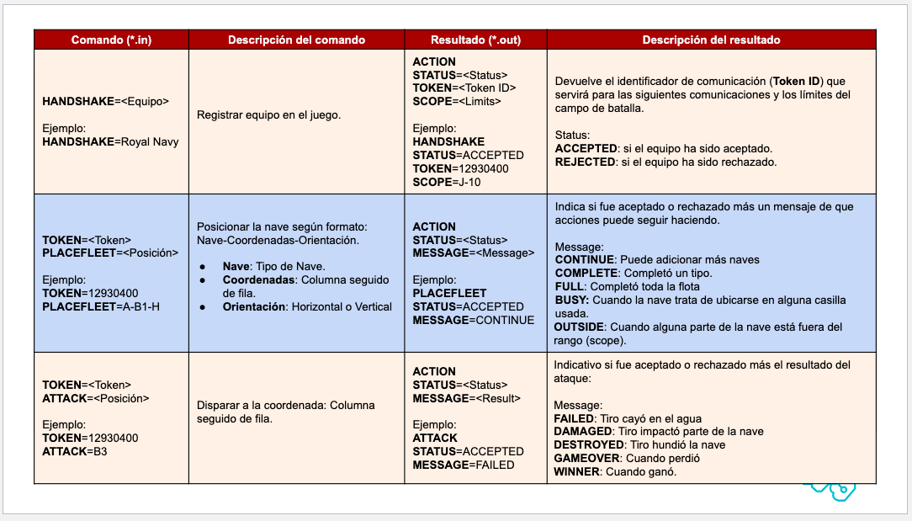
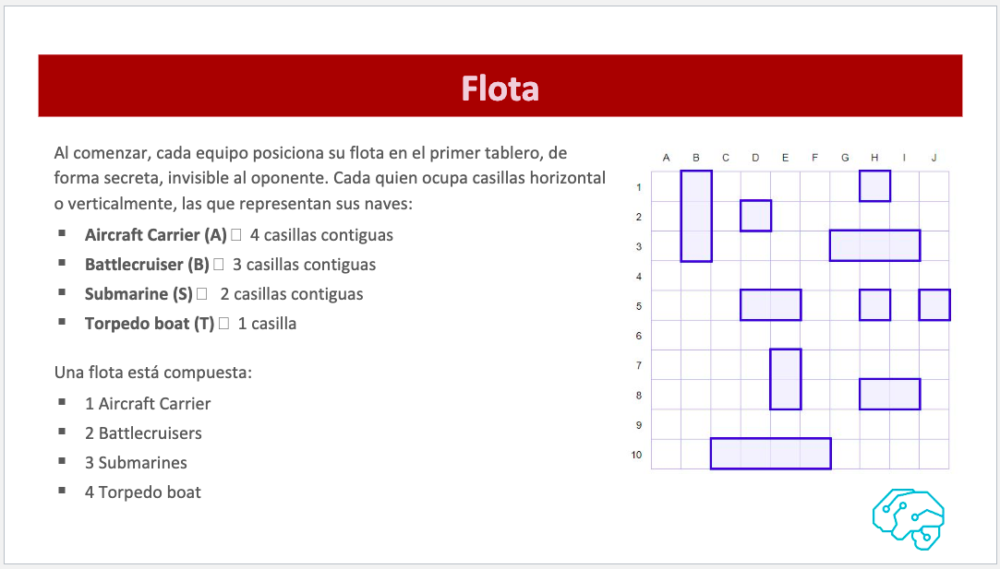

# BATTLESHIP - PROYECTO FINAL DE PROGRAMACIÓN ORIENTADA A OBJETOS II

#
ESTRUCTURA DEL JUEGO
#
Generación de archivos
  Son los archivos .in que se envían al servidor y que este lee para responderle al programa. En estos archivos se envían el nombre del equipo, lugar a poner el barco, entre otros.
  
Lectura de archivos
  Una vez que el servidor haya revisado el archivo enviado por el código, este retorna una archivo .out que su respuesta puede aceptar como rechazar el archivo leído.
  
  
Placemente 
  En esta parte es donde se posicionan los barcos. Son 10 barcos a posicionar, cuatro Aircraft Carrier, tres Battlecruiser, dos Submarine y un Torpedo.
  
Attack
  Finalmente, se realizan los ataques por turnos. Cada turno se va a generar un archivo .in con la coordenada a la cual ha atacado el jugador y el servidor devuelve una instrucción dependiendo si es que le dio a un barco, falló, le dio a un barco o se hundió a un barco.
#
¿CÓMO LLEGAMOS A IMPLEMENTAR ESOS RESULTADOS?
#
  En primer lugar, nos juntamos a trabajar para compartir ideas y ver cuál es la mejor o más fácil de implementar. Por otra parte, a través de un grupo de whatsapp lográbamos coordinar si es que faltaba algo o si es que a alguien le falto algo, de esa manera los tres estábamos al tanto de todo lo que sucedía. 
#
CONCLUSIONES Y RECOMENDACIONES
#
